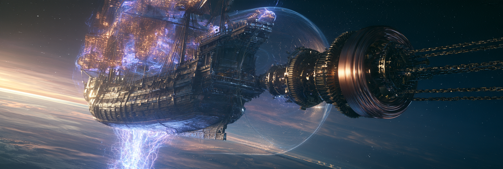

  

# Ethereal Mining Company

The Ethereal Mining Company is a premier resource extraction and orbital logistics corporation operating across the planet of Ur. Our primary objective is to harvest the highly specialized geological materials required to construct and maintain the planetary orbital infrastructure. By systematically extracting conductive trace metals, piezoelectric quartz, and ferromagnetic ores, we provide the raw physical components necessary to operate Magnetohydrodynamic satellites. This allows us to safely siphon high-voltage electrical potential directly from the planet's magnetic dynamo, successfully overriding the natural transmission state of the planet to bypass the Inverse-Square Law.

## Sylvanus Heavy Metals Division
Our Sylvanus division focuses on the extraction of rare-earth elements, iron, and copper. Geological ages ago, primordial heavy metal asteroids from the planetary accretion disk struck the subcontinent and heavily seeded the soil with these highly conductive materials. We harvest these trace metals to construct the massive iron stators and copper superconducting coils physically required for orbital power generation.

## Borealian Magnetite Extraction
Operating within the frozen Ferromagnetic Tundras, this initiative mines virtually limitless deposits of surface-level magnetite. This raw iron ore is essential for forging steel tools and advanced magnetic technology. Because the region is subjected to brutal freezing temperatures and shifting magnetic permeability, the company actively maintains a massive maritime supply chain.

## Australis Quartz Logistics
The Australis branch is tasked with recovering pure piezoelectric quartz from the hyper-arid Piezoelectric Crystal Deserts. The continuous mechanical flexing of the crust by Ur's three moons violently squeezes the quartz dunes, discharging chaotic high-frequency electrical potentials via the piezoelectric effect. To safely harvest this quartz, the company imports heavy conductive copper and iron from Sylvanus to construct heavily grounded infrastructure. This infrastructure safely disperses the wild electrical discharges, protecting our personnel and equipment.

## Caldera Ring Bismuth Operations
Our operations within the Thermoelectric Calderas take advantage of a fractured volcanic island arc scattered across a major tectonic trench. By utilizing the extreme temperature gradients between magma-heated volcanic vents and the cool ambient ocean air, we harness continuous direct electrical current via the Seebeck effect. This environment provides our foundries with near-limitless electrical power for advanced metallurgy and grants direct surface access to raw bismuth.

## Orbital Fleet and Logistics
To transport these harvested materials into low planetary orbit, the company utilizes a highly specialized fleet of orbital galleons constructed from the metallic-tinted timber of the Vallenwood trees, which biologically hyper-accumulate conductive trace metals from the soil. As established in our conversation history regarding Ethereal aeronautics, the metallic hulls of these vessels function as massive Faraday cages. As high-voltage electrical potential flows through the conductive structure, it generates a localized magnetosphere that physically traps a pocket of breathable atmospheric gases and deflects lethal cosmic radiation. Instead of chemical thrusters, our ships utilize massive sails woven with dense copper threading to catch ionized Birkeland currents, allowing our crews to ride the planet's magnetic flux directly into orbit.

## Current Projects
[OSAP (Orbital Sizing & Assessment Protocol)](https://github.com/Ethereal-Mining-Company/small-body-project)
